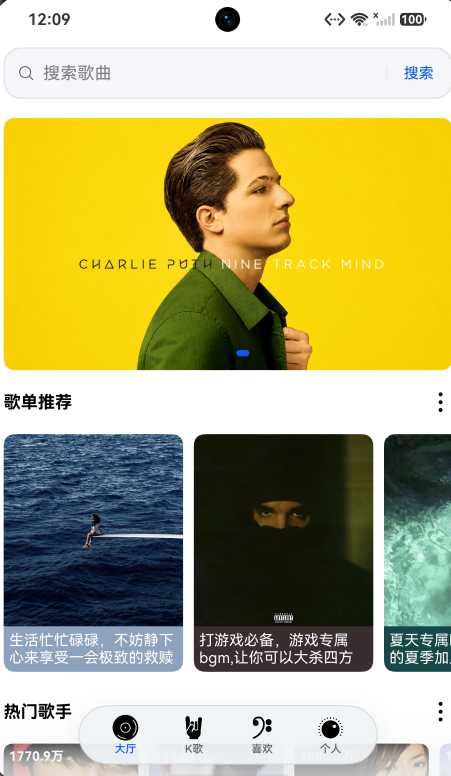
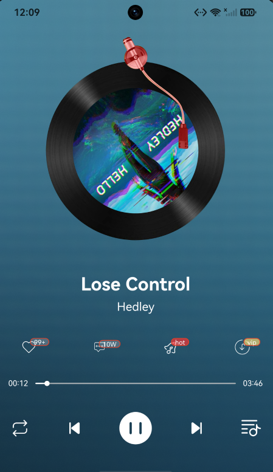
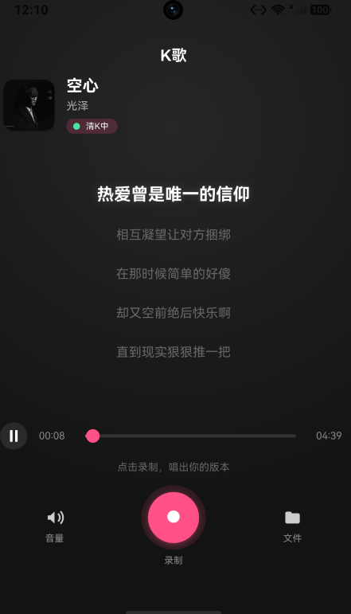
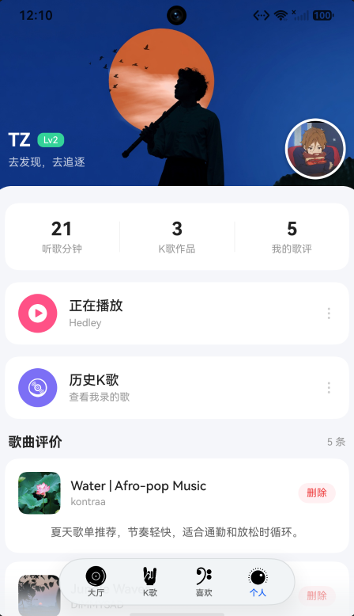

# TZ Music

一款基于 **HarmonyOS** 开发的本地音乐应用，使用 ArkTS 与 ArkUI 构建，覆盖音乐浏览、音频播放、后台媒体会话、PCM 录音试听与本地数据管理等客户端开发场景。

## 功能概览

- 推荐大厅：展示推荐歌曲、歌手与音乐内容。
- 音乐播放：支持本地 Rawfile 音频播放、播放列表管理、上一首/下一首、进度拖动，以及顺序、随机和单曲循环模式。
- 后台播放：接入 AVSession，支持系统媒体控制、播放状态同步与后台音频任务。
- 收藏与播放列表：管理喜欢的歌曲与当前播放列表。
- K 歌录音：申请麦克风权限后录制 PCM 音频，支持试听、重录、保存、历史记录查看与删除。
- 歌曲评价：可添加、查看和删除歌曲评价。
- 个人中心：展示累计听歌时长、历史 K 歌记录、当前播放信息与登录状态。

## 技术栈

| 分类 | 技术 |
| --- | --- |
| UI 与语言 | ArkTS、ArkUI、Navigation、AppStorageV2 |
| 音频播放 | `AVPlayer`、`AVSession`、后台音频任务 |
| 录音与试听 | `AudioCapturer`、`AudioRenderer`、PCM |
| 本地数据 | Preferences、File I/O、Rawfile |
| 工程构建 | DevEco Studio、Hvigor、OHPM |

> `AppStorageV2` 用于跨页面共享播放状态；收藏、评论、听歌时长和 K 歌历史等数据使用 Preferences 持久化。

## 项目预览

将真机或模拟器截图放入 `docs/images/` 后，README 会通过相对路径展示图片；这些图片不会被打包到应用中。

| 推荐大厅 | 播放页 |
| --- | --- |
|  |  |

| K 歌 | 个人中心 |
| --- | --- |
|  |  |

## 项目结构

```text
TZmusic/
├─ docs/
│  └─ images/             # README 项目截图（不参与应用打包）
├─ entry/
│  └─ src/main/
│     ├─ ets/
│     │  ├─ pages/        # 推荐、播放、K 歌、录音、个人中心等页面
│     │  ├─ models/       # 播放、收藏、评价、听歌时长等状态与存储
│     │  ├─ utils/        # AVPlayer 与 AVSession 管理
│     │  └─ data/         # 推荐歌曲和歌评数据
│     └─ resources/
│        ├─ base/media/   # 应用图片与图标资源
│        └─ rawfile/      # 本地音频资源
├─ build-profile.json5
└─ hvigorfile.ts
```

## 环境要求

- DevEco Studio
- HarmonyOS SDK：与项目配置中的 `6.0.2(22)` 保持兼容
- 真机调试建议使用 HarmonyOS 手机；K 歌录音功能需要授予麦克风权限

## 运行方式

1. 使用 DevEco Studio 打开本项目根目录。
2. 等待 OHPM 依赖同步与 SDK 配置完成。
3. 连接设备或启动模拟器。
4. 选择 `entry` 模块，点击运行即可安装调试。

也可以在 PowerShell 中构建：

```powershell
.\hvigorw.bat --mode module -p product=default assembleHap
```

未配置签名时，构建产物通常位于：

```text
entry\build\default\outputs\default\entry-default-unsigned.hap
```

配置签名后可生成签名包。

## 权限说明

| 权限 | 用途 |
| --- | --- |
| `ohos.permission.INTERNET` | 加载网络歌曲封面或音乐资源 |
| `ohos.permission.KEEP_BACKGROUND_RUNNING` | 保持后台音频播放 |
| `ohos.permission.MICROPHONE` | K 歌录音 |

## 说明

本项目中的歌曲、图片等资源仅用于学习与演示，请勿用于商业用途。
